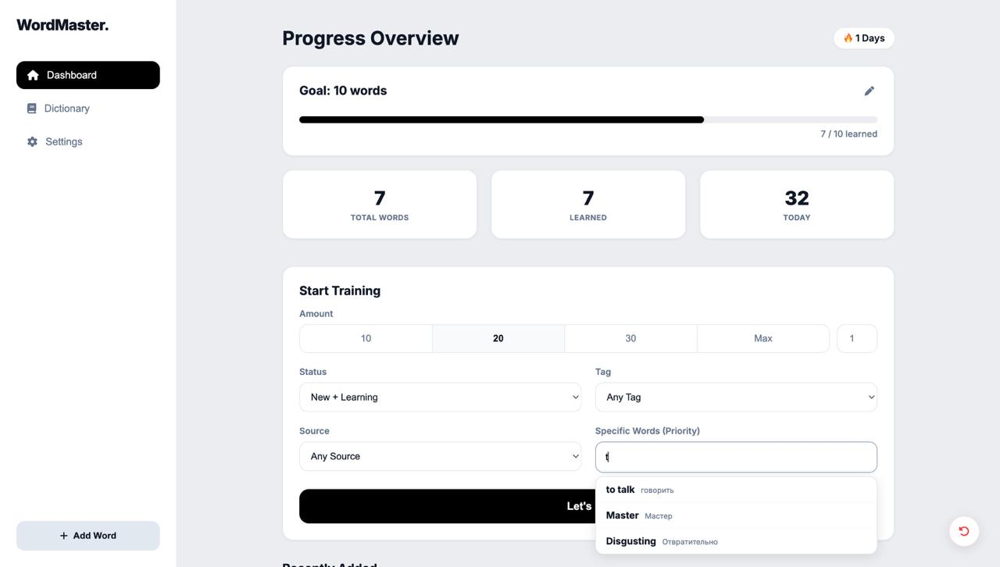
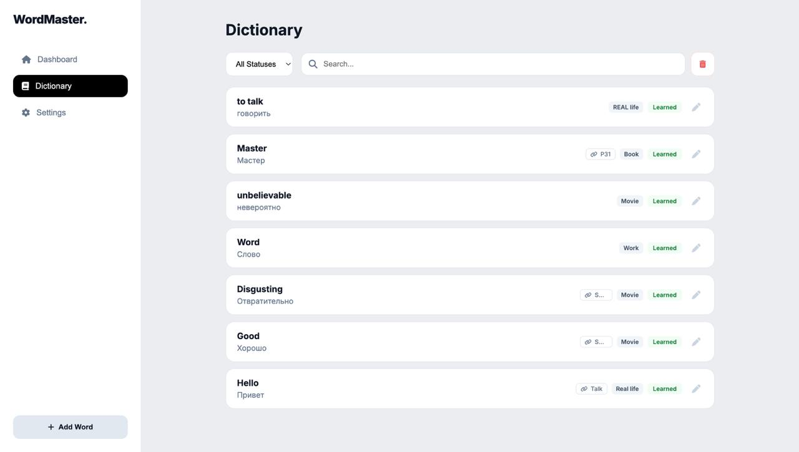
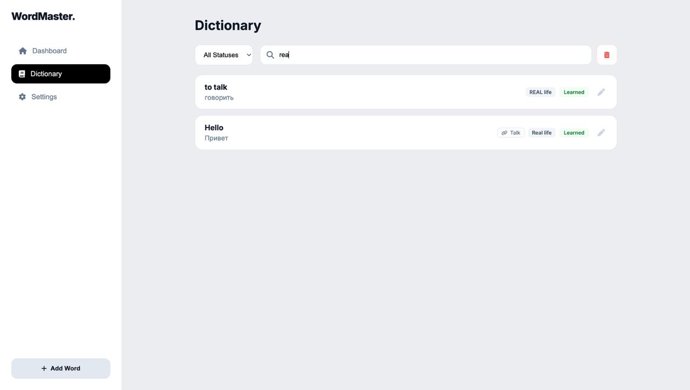
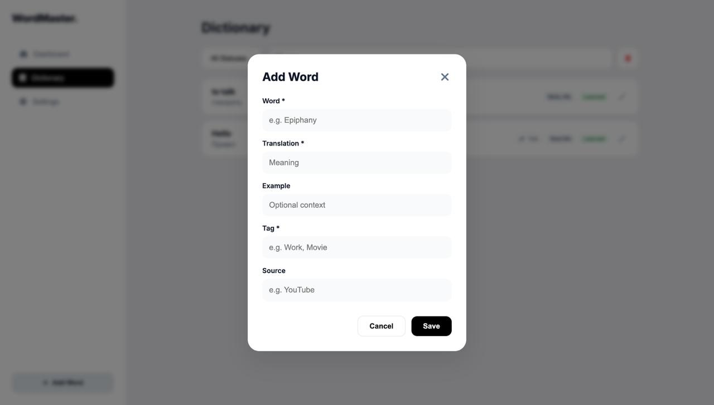
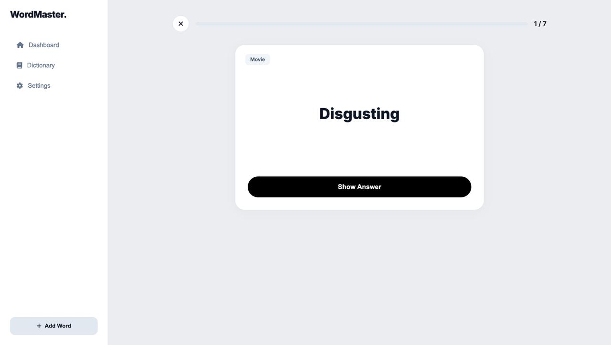
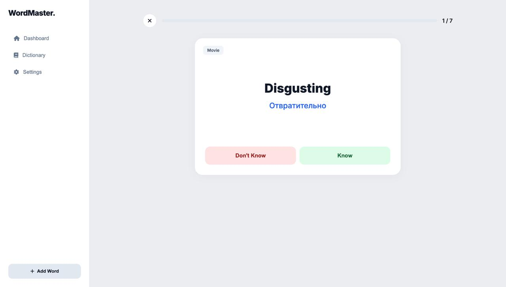
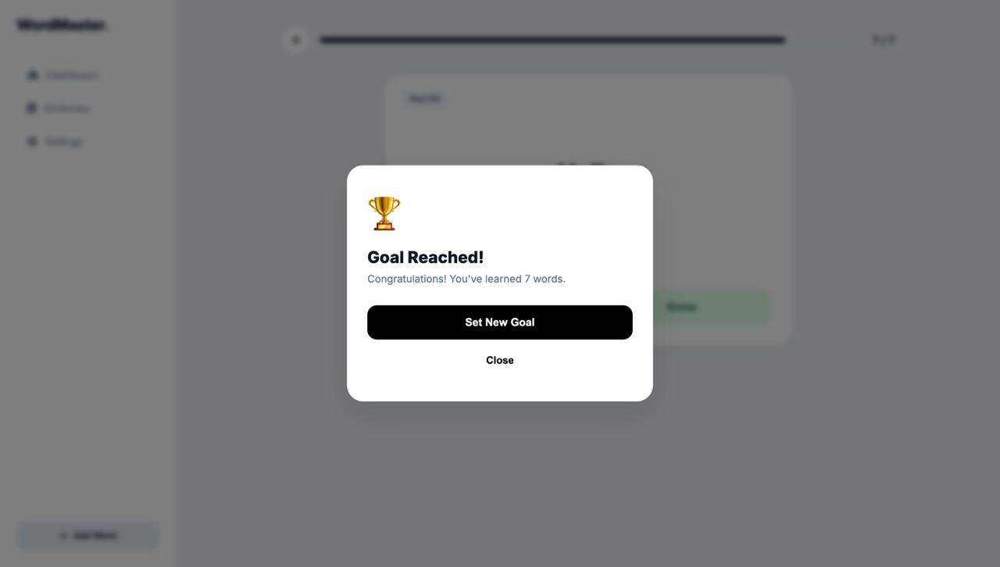
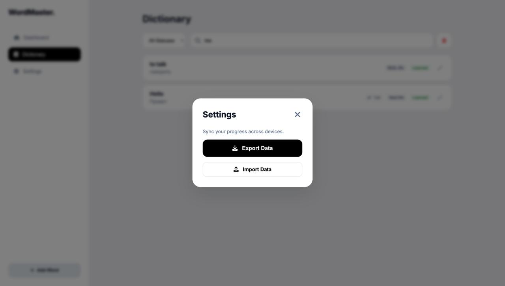

## **WordMaster — Smart Vocabulary Learning App**

WordMaster is a web-based vocabulary learning application designed to help users learn and retain foreign language words in a structured and efficient way.
The project focuses on practical language learning, progress tracking, and a clean, distraction-free user experience.

### **🎯 Project Goal**

The goal of this project was to build a fully functional learning tool, not just a UI demo.
The app helps users:
-	store vocabulary words with metadata,
-	train words in controlled learning sessions,
-	track daily progress and learning streaks,
-	manage data locally with import/export functionality.

⸻

## **✨ Features**

**Dashboard**
-	learning goal with progress bar
-	statistics:
-	total words
-	learned words
-	words studied today
-	learning streak
-	customizable training session:
-	number of words (10 / 20 / 30 / max / custom)
-	filter by status (new / learning / learned)
-	filter by tag
-	filter by source
-	priority list for specific words

**Dictionary**
-	Full list of all words
-	Search by text / translate / tag / source
-	Filter by learning status
-	Visual status indicators (new / learning / learned )
-	Edit and delete existing words

**Training Mode**
-	Step-by-step learning flow:
-   word + tag shown first
- 	translation and example revealed on demand
-	Simple feedback system:
-	“I know”
-	“I don’t know”
-	Learning results directly affect statistics and progress

**Word Management**
-	Add new words with:
-	word (required)
-	translation (required)
-	example (optional)
-	tag (required)
-	source (optional)
-	Edit existing words
-	Delete words with confirmation modal

### **Data Management**
-	Import vocabulary from JSON
-	Export all data to JSON
-	Local storage persistence (no backend required)

### **UI & UX**
-	Clean, app-like interface
-	Fully responsive (desktop, tablet, mobile)
-	Modal system for confirmations and settings
-	Keyboard- and focus-friendly interactions

⸻

### **🛠️ Tech Stack**
-	HTML — semantic structure
-	CSS — layout, responsive design, UI states
-	Vanilla JavaScript — application logic and state management
-	LocalStorage — persistent data storage
-	Git & GitHub — version control

No frameworks were used to better understand core web fundamentals.

⸻

### **🤖 Use of AI Tools**

AI tools were used as an assistant, not as an automatic generator.

Specifically, AI was used to:
-	speed up routine code writing,
-	brainstorm UI and UX solutions,
-	help refactor and improve existing logic.

All core decisions, application logic, structure, and feature design were defined and implemented by me.
AI served as a productivity tool, similar to documentation or autocomplete.

⸻

### **📚 Educational Value**

Through this project, I:
-	designed a complete application flow from idea to implementation,
-	learned to structure application state without frameworks,
-	practiced UI/UX decisions for real users,
-	implemented filtering, progress tracking, and data persistence,
-	improved my understanding of responsive design.

⸻

### **🧠 Reflection**

This project taught me how much planning and structure matter in real applications.
Before writing code, I had to clearly define:
-	how learning sessions should work,
-	how user progress should be calculated,
-	how data should be stored and restored safely.

I also learned that using AI effectively is not about replacing thinking, but about saving time on technical details so more focus can be spent on logic, structure, and user experience.

**If I continued this project, I would like to:**
-	add cloud sync and authentication,
-	implement spaced repetition algorithms,
-	add statistics over longer periods.

⸻

### 📄 **License**

- This project was created for educational purposes.

## 🌐 Live Demo
GitHub Pages: https://nikkyway.github.io/WordMaster/
### How to test locally
Open `index.html` in a browser (or use VS Code / WebStorm Live Server).

⸻

## **📸 Screenshots**

### Dashboard & Progress

### Dictionary & Word Management

### Study Mode

### Results & Progress

### Settings

